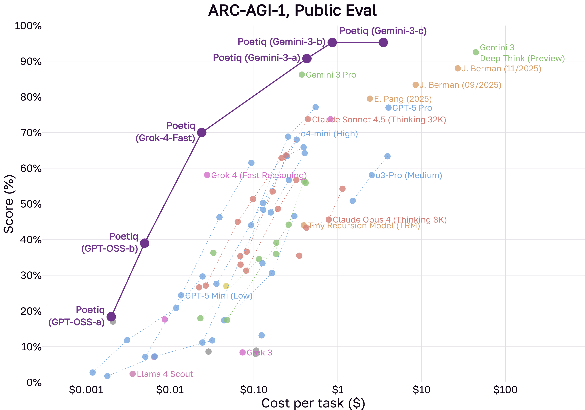
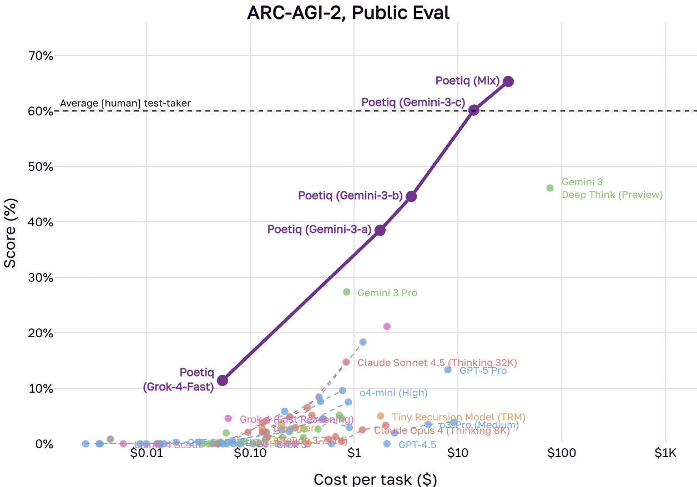
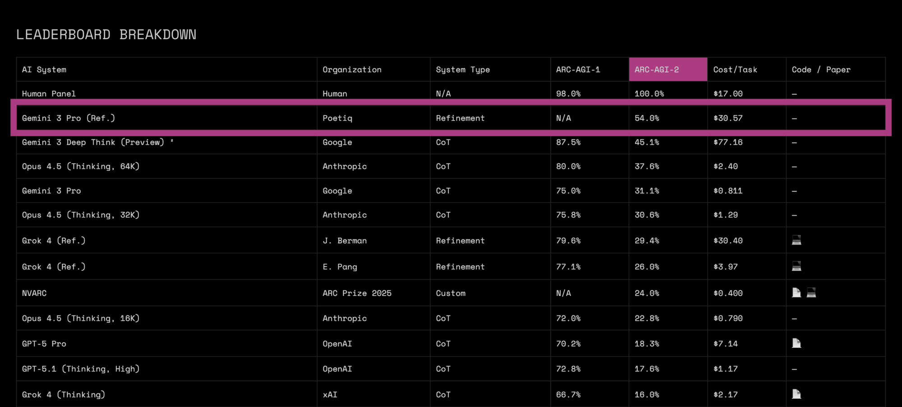
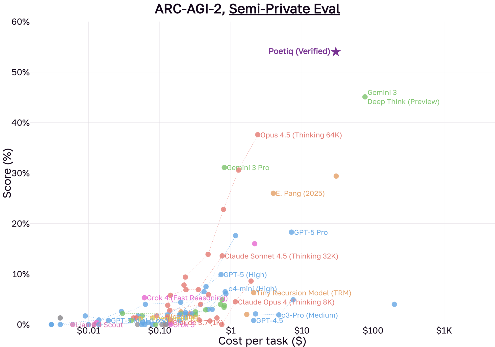

# [Poetiq](https://poetiq.ai): SOTA Reasoning on ARC-AGI

[](https://opensource.org/licenses/MIT)
[](https://www.python.org/downloads/)
[](https://arcprize.org/)

This repository allows reproduction of **Poetiq's** record-breaking submission to the ARC-AGI-1 and ARC-AGI-2 benchmarks.

Full analysis is available in our launch post, **[Traversing the Frontier of Superintelligence](https://poetiq.ai/posts/arcagi_announcement/)**.

Our method is now on top of the official leaderboard. More information is in our follow-up post, **[Poetiq Shatters ARC-AGI-2 State of the Art at Half the Cost](https://poetiq.ai/posts/arcagi_verified/)**.

---

## 📊 Public Eval Results
You can recreate the Gemini 3 points from these charts using this repo.

<p align="center">
  
  
</p>

## 📊 Official Private Eval Results
These are our results on the official leaderboard from ARC Prize, but those problems are kept private.

<p align="center">
  
</p>
<p align="center">
  
</p>

## 🛠️ Usage

### Prerequisites
- Python 3.11+
- API Keys for the models you wish to test (Gemini, OpenAI, etc.)

### Quick Start

1. Setup the environment:
   ```bash
   python -m venv .venv
   source .venv/bin/activate
   pip install -r requirements.txt
   ```

2. Create a .env file in the root directory. You must include keys for the models you intend to run.

    ```bash
    GEMINI_API_KEY=...
    OPENAI_API_KEY=...
    ```

3. Modify the constants in main.py to set the problem set, number of problems, etc. Then run the script:

    ```bash
    python main.py
    ```

4. By default, the code runs the Poetiq 3 config described in the blog post. You can uncomment other ones or modify the config in config.py

## 📄 Contact
If you use this code or these results in your research, please cite our blog post:

Poetiq Team. (2025). *Traversing the Frontier of Superintelligence*. Poetiq AI. [https://poetiq.ai/posts/arcagi_announcement/](https://poetiq.ai/posts/arcagi_announcement/)

For questions or to discuss the future of reasoning, reach out to us at poetiq@poetiq.ai.

[](https://x.com/poetiq_ai)
[](https://www.linkedin.com/company/poetiq/)
[](https://bsky.app/profile/poetiq-ai.bsky.social)
